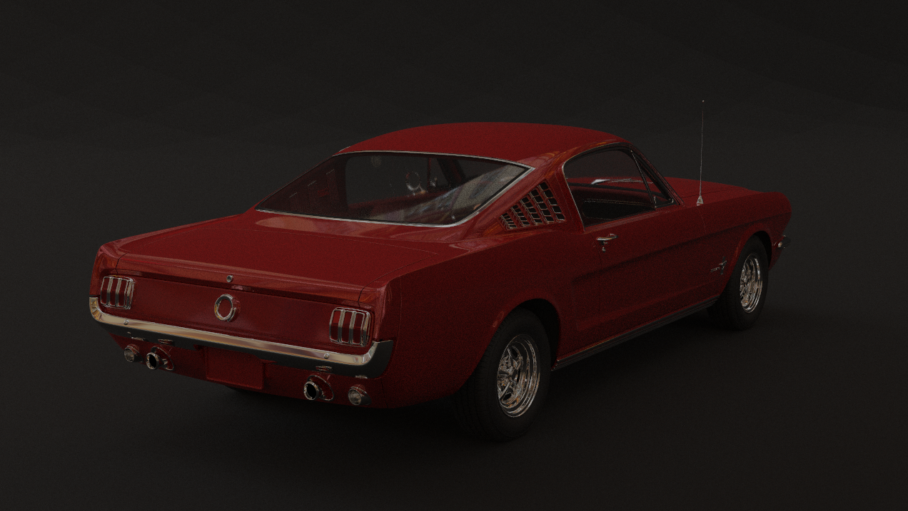
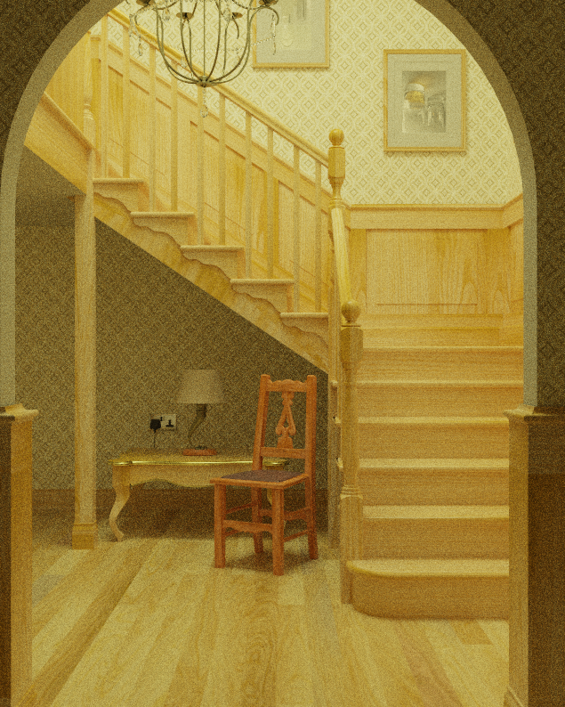

# Ray Tracing in Vulkan Compute Shader

Vulkan compute shade implementation of the **[Disney BSDF model](https://blog.selfshadow.com/publications/s2015-shading-course/burley/s2015_pbs_disney_bsdf_notes.pdf)**. 

## Feature

- Two-level BVH for instancing
- Wavefront obj support and material described by json
- Environment mapping
- Texture mapping
- Area lights defined by mesh
- FPS style camera for scene preview

## TODOs

- [ ] BVH light sampling
- [ ] Denoiser
- [ ] Medium support
- [ ] Move raytracing command submitting to second CPU thread
- [ ] Migrate to hardware raytracing ([VK_KHR_ray_tracing_pipeline](https://registry.khronos.org/vulkan/specs/1.3-extensions/man/html/VK_KHR_ray_tracing_pipeline.html))

## Gallery






## Build

The raytracer supports Windows and Linux. 

1. It requires vulkan sdk to run: [Vulkan SDK](https://vulkan.lunarg.com/sdk/home). If you are on Windows, please make sure the `$VULKAN_SDK` environment value is set and point to the sdk folder.
2. Pull the repository with all submodules.

```bash
git clone --recursive https://github.com/pozero/RayTracing
```

3. Run cmake and build.
4. Run the raytracer with command

```
./Raytracing <selected_scene_file>
```

## References

- [knightcrawler25/GLSL-PathTracer](https://github.com/knightcrawler25/GLSL-PathTracer)
- [Physically Based Rendering 4ed](https://pbr-book.org/4ed/contents)
- [wdas/brdf](https://github.com/wdas/brdf)
- [mmacklin/tinsel](https://github.com/mmacklin/tinsel)
- [Physically Based Shading at Disney](https://blog.selfshadow.com/publications/s2012-shading-course/burley/s2012_pbs_disney_brdf_notes_v3.pdf)
- [Extending the Disney BRDF to a BSDF with Integrated Subsurface Scattering](https://blog.selfshadow.com/publications/s2015-shading-course/burley/s2015_pbs_disney_bsdf_notes.pdf)
- [Rendering the Moana Island Scene Part 1: Implementing the Disney BSDF](https://schuttejoe.github.io/post/disneybsdf/)

## Scene format

Scenes are defined in json files, referencing objs and textures at the same directory. Here's an example:

```json
{
    "renderer": {
        "resolution": [1280, 720],
        "max_depth": 7,
        "tile": [128, 72]
    },
    "camera": {
        "lookfrom": [7.0, 2.0, 9.0],
        "lookat": [0.0, 0.0, 0],
        "fov": 22.0
    },
    "material": {
        "floor": {
            "albedo": [0.9, 0.9, 0.9],
            "roughness": 1.0
        },
        "blue": {
            "albedo": [0.0, 0.29, 0.99],
            "roughness": 0.0,
            "metallic": 0.2,
            "clearcoat": 1.0
        },
        "black": {
            "albedo": [0.008, 0.008, 0.008],
            "roughness": 1.0
        },
        "metal": {
            "albedo": [0.9, 0.9, 0.9],
            "roughness": 0.3,
            "anisotropic": 0.4,
            "metallic": 1.0
        },
        "headlight": {
            "albedo": [1.0, 1.0, 1.0],
            "roughness": 0.1,
            "spec_trans": 1.0,
            "ior": 1.45
        },
        "black_interior": {
            "albedo": [0.1, 0.1, 0.1],
            "roughness": 0.5,
            "ior": 1.1
        },
        "red_taillight": {
            "albedo": [0.581, 0.009, 0.009],
            "roughness": 0.0,
            "metallic": 0.738
        },
        "tyres": {
            "albedo": [0.008, 0.008, 0.008],
            "roughness": 0.5
        },
        "black_glass": {
            "albedo": [0.2, 0.2, 0.2],
            "roughness": 0.0,
            "spec_trans": 1.0,
            "ior": 1.45
        }
    },
    "primitive": {
        "floor": {
            "mesh": "sportscar/Plane.obj",
            "material": "floor"
        },
        "body": {
            "mesh": "sportscar/Body.obj",
            "material": "blue"
        },
        "chassis": {
            "mesh": "sportscar/Chassis.obj",
            "material": "black"
        },
        "drive_train": {
            "mesh": "sportscar/DriveTrain.obj",
            "material": "metal"
        },
        "engine_room": {
            "mesh": "sportscar/EngineRoom.obj",
            "material": "metal"
        },
        "head_light": {
            "mesh": "sportscar/HeadLight.obj",
            "material": "headlight"
        },
        "room": {
            "mesh": "sportscar/Room.obj",
            "material": "black_interior"
        },
        "sus": {
            "mesh": "sportscar/Sus.obj",
            "material": "metal"
        },
        "tail_lamp": {
            "mesh": "sportscar/TailLamp.obj",
            "material": "red_taillight"
        },
        "wheels": {
            "mesh": "sportscar/Wheels.obj",
            "material": "tyres"
        },
        "window": {
            "mesh": "sportscar/Window.obj",
            "material": "black_glass"
        },
        "wiper": {
            "mesh": "sportscar/Wiper.obj",
            "material": "black"
        }
    },
    "light": {
        "area": {
            "light1": {
                "intensity": [5.0, 5.0, 5.0],
                "two_sided": false,
                "mesh": "sportscar/RectLight1.obj"
            },
            "light2": {
                "intensity": [5.0, 5.0, 5.0],
                "two_sided": false,
                "mesh": "sportscar/RectLight2.obj"
            },
            "light3": {
                "intensity": [5.0, 5.0, 5.0],
                "two_sided": false,
                "mesh": "sportscar/RectLight3.obj"
            }
        }
    }
}
```
