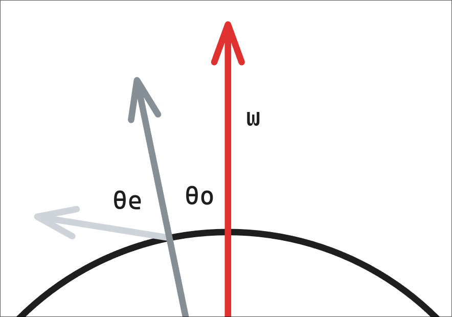
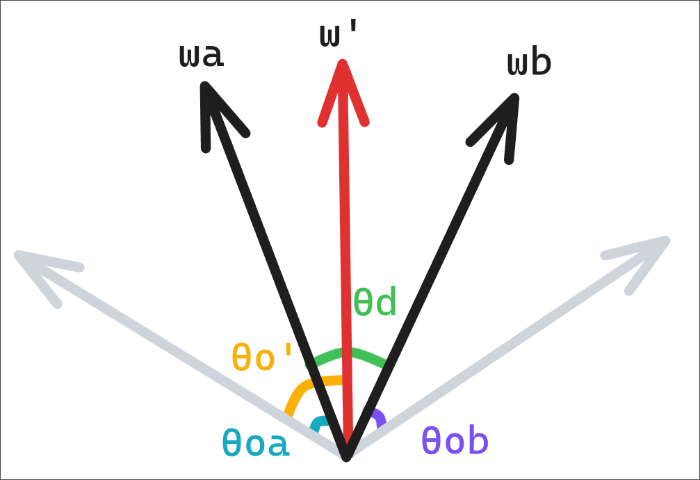
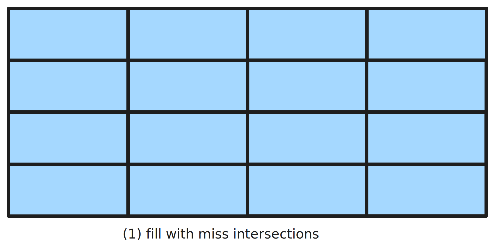
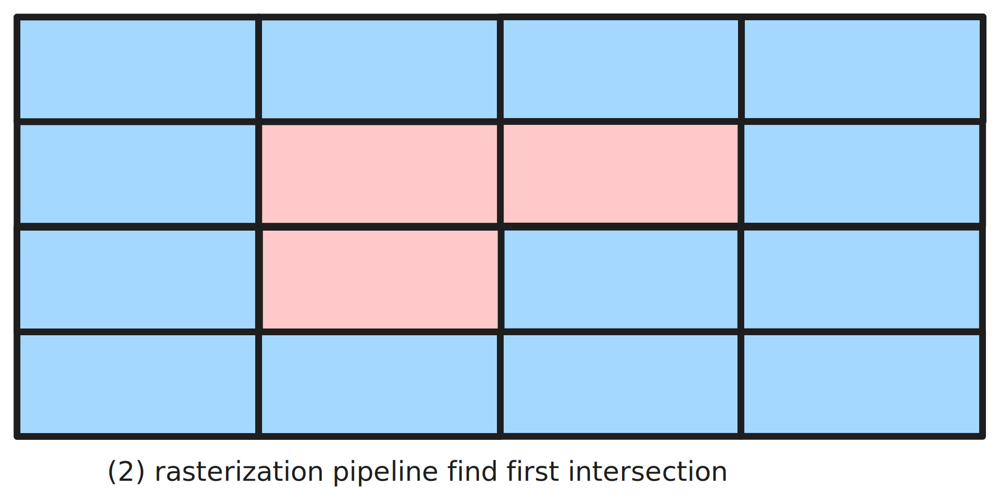
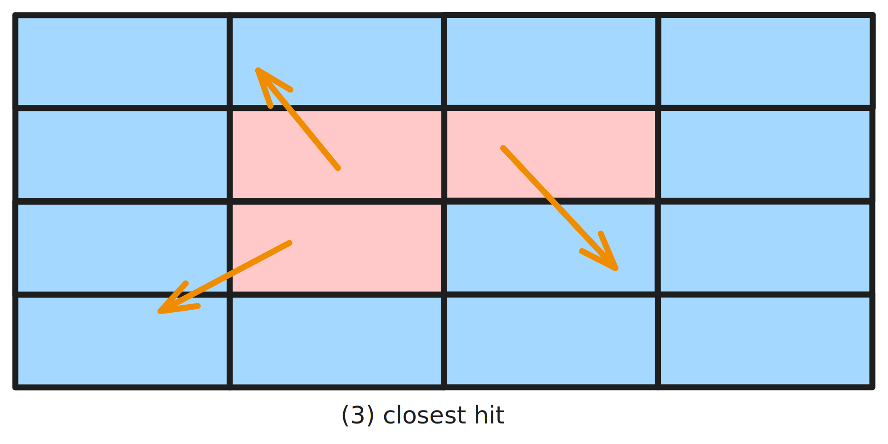
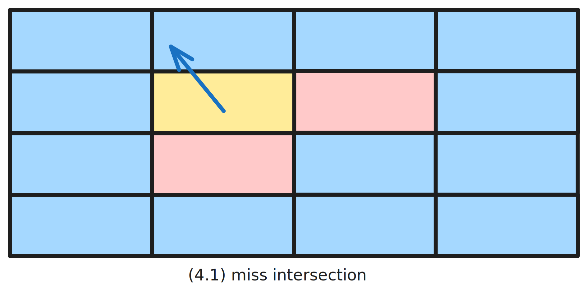
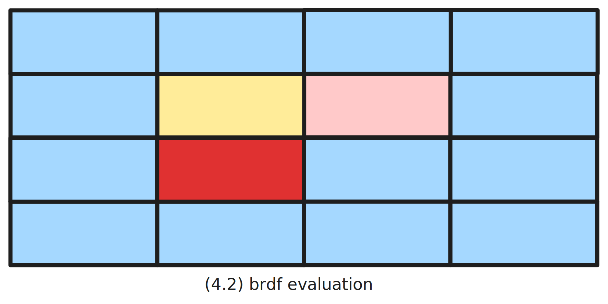
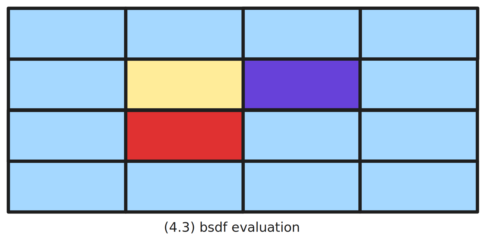
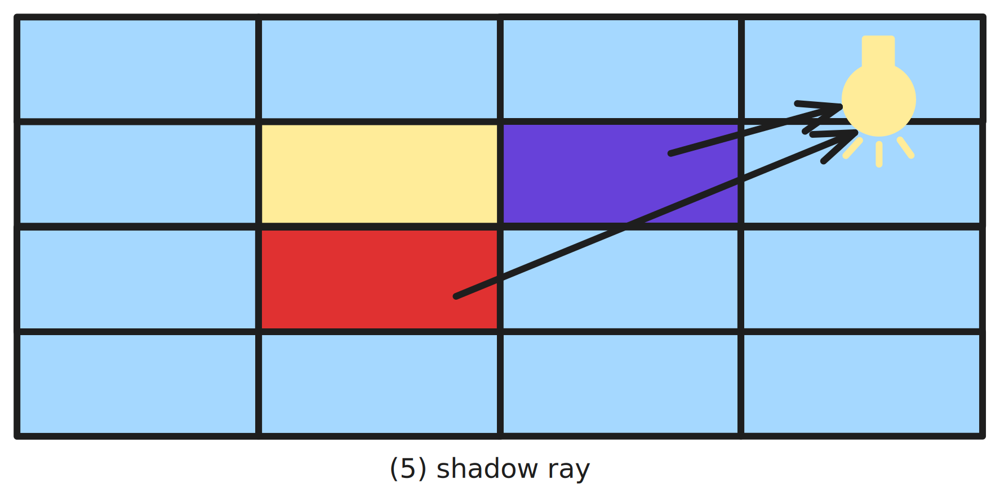

# Notes

## Monte Carlo

### The Monte Carlo Estimator

The estimator is defined as

$$
F_n = \frac1n\sum_{i=1}^n\frac{f(X_i)}{p(X_i)}
$$

Its expectation equals to 

$$
\begin{align}
E[F_n]&=E\left[\frac1n\sum_{i=1}^n\frac{f(X_i)}{p(X_i)}\right]\\
&=\frac1n\sum_{i=1}^n\int_X\frac{f(x)}{p(x)}p(x)dx\\
&=\frac1n\sum_{i=1}^n\int_Xf(x)dx\\
&=\int_Xf(x)dx\\
\end{align}
$$

### Multiple Importance Sampling

Given $n$ sampling distributions $p_i$ with $n_i$ samples $X_{i, j}$ taken from the $i$th distribution, the MIS Monte Cralo estimator is

$$
F_n=\sum_{i=1}^n \frac1n_i \sum_{j=1}^{n_i} w_i(X_{i, j})\frac{f(X_{i, j})}{p_i(X_{i, j})}
$$

There are several choices for the weighting function, *balance heuristic* is a good one

$$
w_i(x) = \frac{n_ip_i(x)}{\sum_jn_jp_j(x)}
$$

or *power heuristic* with $\beta=2$

$$
w_i(x) = \frac{(n_ip_i(x))^\beta}{\sum_j(n_jp_j(x))^\beta}
$$

#### Single Sample Model

Monte Carlo can go even further without sampling all the possible distribution, instead just sample one of them with probability $q_i$. The single sample estimator is

$$
\frac{w_i(x)}{q_i}\frac{f(x)}{p_i(x)}
$$

#### MIS Compensation

The MIS Compensation is based on the idea of sharpening some of the distribution. The transformed distribution is defined by

$$
p'(x)=\frac{\max(0, p(x) - \delta)}{\int\max(0, p(x) - \delta)dx}
$$

## Lights

### Union of Light Cones

Light cone in pbrt is defined as

and the union of light cone is shown below

## Reflection Models

## Useful Sampling Algorithms

### Uniformly Sampling a Unit Disk

Given the random point $(x,y)$, its pdf should be $p(x, y)=\frac1\pi$ by definition. So in polar corrdinates, the pdf is $p(r,\theta) = \frac r\pi$, which gives

$$
r=\sqrt{\xi_1}\\
\theta=2\pi\xi_2
$$

### Uniformly Sampling Hemispheres

Similarly the random point pdf is $p(x, y, z) = \frac1 {2\pi}$, and in polar coordinate the pdf is $p(\theta, \phi)=1^2sin\theta p(x, y, z)$. Since $\phi$ ranges from $0$ to $2\pi$ with a constant density, we can get the following pdfs

$$
p(\phi) = \frac1{2\pi}\\
p(\theta) = \sin\theta\\
$$

Apply inversion method, we get

$$
\begin{align}
\theta&=\cos^{-1} \xi_1\\
\phi&=2\pi \xi_2
\end{align}
$$

### Uniformly Sampling a Triangle

$$
(\xi_1 - \delta,
\xi_2 - \delta,
1 - (\xi_1 - \delta) - (\xi_2 - \delta))\text{, where }
\delta = 
\begin{cases}
\xi_1 / 2,&\xi_1 < \xi_2,\\
\xi_2 / 2,&\text{otherwise},\\
\end{cases}
$$

## Wavefront Ray Tracer Architecture

